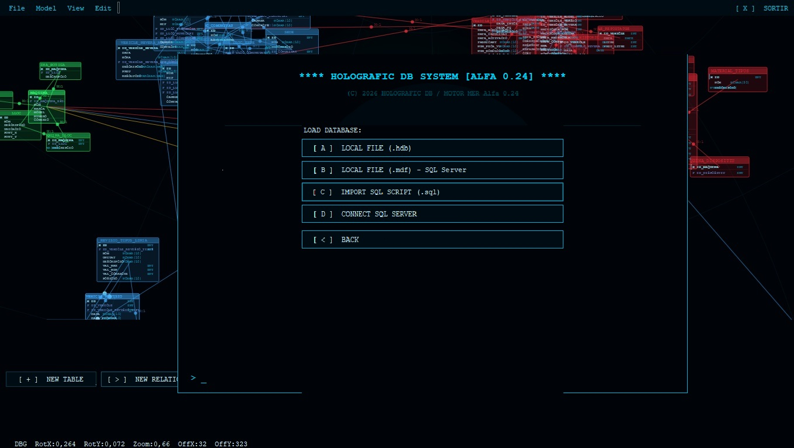
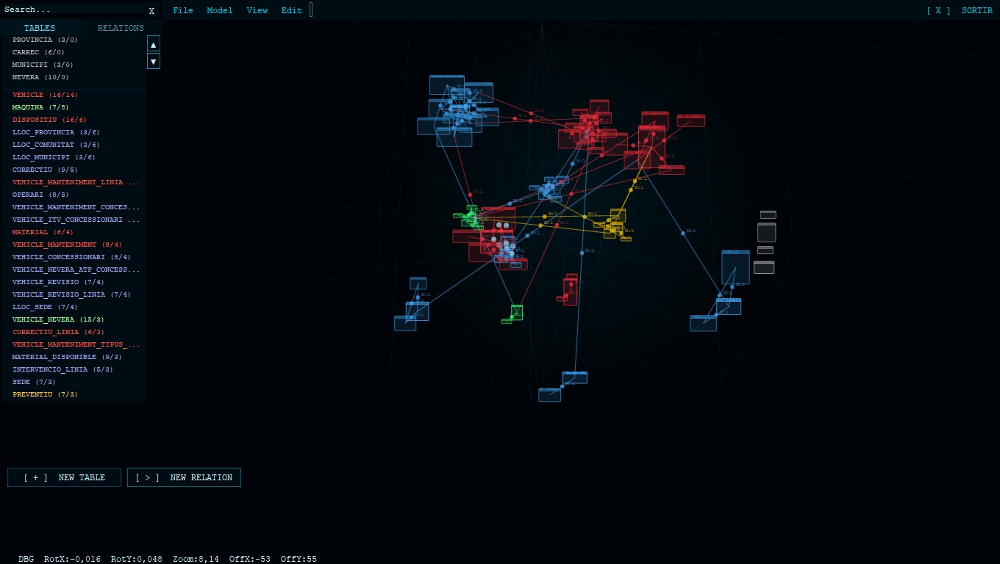
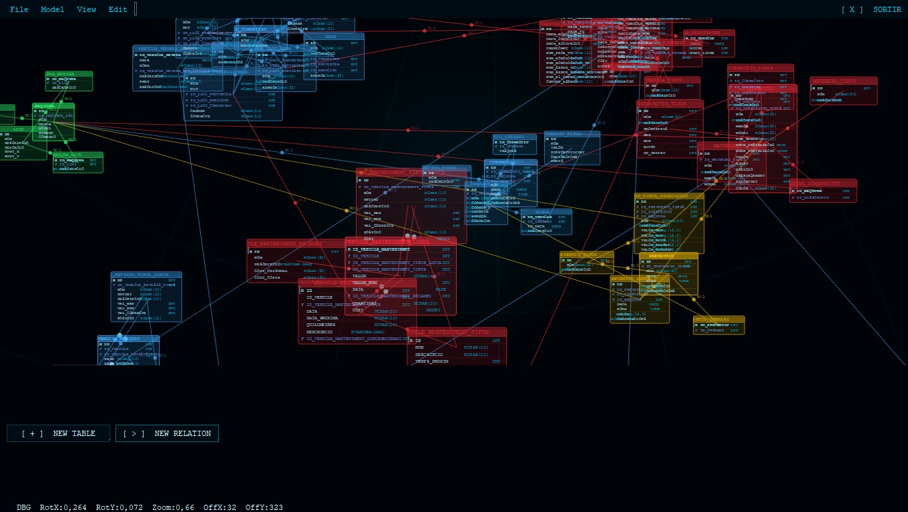

# Holographic DB

**Visual relational database designer with a 3D holographic interface.**

Holographic DB is a desktop application for Windows that allows you to design, document, validate, and export the complete structure of a relational database. Tables are distributed across a navigable three-dimensional sphere, featuring a cyberpunk/terminal aesthetic inspired by 1980s VT100 terminals.







---

## ✨ Main Features

- **3D Workspace:** Tables are distributed over a sphere (using a Fibonacci distribution) with an orbital camera, zoom focused on the cursor, panning, and rotational inertia.
- **Strict Entity-Relationship Model:** A real-time ERM validation engine blocks invalid operations (such as an FK not pointing to a PK, incompatible data types, direct M:M relationships, duplicates, etc.). Tables with violations flash in red on the sphere.
- **Full T-SQL Field Editing:** Access to all SQL Server attributes — data types, IDENTITY, computed columns, CHECK constraints, DEFAULT values, collations, Dynamic Data Masking, ROWGUIDCOL, FILESTREAM, extended properties/descriptions, and more.
- **Undo/Redo:** A complete command stack allows you to undo and redo actions (adding/deleting/moving tables, fields, and relationships).
- **Automatic Group Organization:** Features community detection within the relationship graph (Label Propagation) with automatic coloring and concentric circle distribution.
- **Importing:**
  - SQL Scripts (`.sql`) with dialect normalization (MySQL/PostgreSQL → T-SQL)
  - SQL Server LocalDB `.mdf` files
  - Direct connection to networked SQL Server instances (Windows or SQL Server Authentication)
- **Exporting:**
  - Full DDL generation for SQL Server (T-SQL), MySQL/MariaDB, and PostgreSQL
  - Direct creation of physical `.mdf` files via LocalDB
  - Deploying the model (fully or partially) directly to a live SQL Server instance
- **Multi-language Support:** Instantly switch between Catalan, Spanish, and English from the settings menu
- **Open Project Format:** Projects are saved as human-readable JSON within `.hdb` files

---

## 🛠️ Tech Stack

| Component | Technology |
|---|---|
| **Platform** | Windows 10/11 (x64) |
| **Language** | Visual Basic .NET |
| **Framework** | .NET 8 (`net8.0-windows`) |
| **Interface** | Windows Forms |
| **Graphics Engine** | SkiaSharp 2.88.8 |
| **Serialization** | Newtonsoft.Json 13.0.3 |
| **SQL Connectivity** | Microsoft.Data.SqlClient 5.2.1 |

---

## 🚀 Compilation

### Requirements

- [.NET 8 SDK](https://dotnet.microsoft.com/download/dotnet/8.0)
- Windows 10/11
- (Optional) [SQL Server Express LocalDB](https://aka.ms/sqllocaldb) — required only for `.mdf` file import/export features

### Steps

```bash
git clone https://github.com/<username>/<repository>.git
cd <repository>
dotnet build -c Release
dotnet run
```

Or open `DBCoreHolographic.slnx` with **Visual Studio 2022** (17.8+) and press **F5**.

> **Note:** The project uses the modern SDK-style format, meaning all `.vb` files are automatically included without needing manual edits to the `.vbproj` file.

---

## 📁 Project Structure

```
DBCoreHolographic.vbproj
Program.vb                 ← Entry point + ApplicationContext
AppStyle.vb                ← Centralized styling (colors, fonts, factories)

Models/                    ← Pure data layer (no UI references)
  CampoBBDD.vb              Field containing all T-SQL attributes
  TablaBBDD.vb              Table (fields, 3D position, color, depth)
  RelacionBBDD.vb           FK relationship (cardinality, ON DELETE/UPDATE...)
  ProyectoBBDD.vb           Full project container
  Enums.vb                  DataType, CardinalityType, FK actions
  OpcionsSistema.vb         User preferences (options.json)

MER/
  IntegrityEngine.vb        ← Validation engine for Entity-Relationship rules

Commands/
  CommandStack.vb           ← Undo/Redo stack (Command pattern)

Data/
  ProjectSerializer.vb      ← Save/load .hdb projects (JSON)
  Locale.vb                 ← Localization provider (CA / ES / EN)

Export/
  TSqlExporter.vb           SQL Server DDL exporter
  MySqlExporter.vb          MySQL/MariaDB DDL exporter
  PostgreSqlExporter.vb     PostgreSQL DDL exporter
  MdfExporter.vb            Physical .mdf file creation via LocalDB
  SqlServerConnector.vb     Networked server connectivity handler

Imports/
  SqlScriptImporter.vb      DDL parser with dialect normalizer
  MdfImporter.vb            Database structure reader from physical .mdf

Graphics/
  SphereRenderer.vb         ← SkiaSharp graphics engine: sphere, tables, relationships, hit-testing

Forms/
  FrmSplash.vb              Loading screen
  FrmMainMenu.vb            VT100-style main menu
  FrmDesigner.vb            Main 3D workspace designer window
  FrmFieldEditor.vb         Field editor (3-tab dialog)
  FrmRelationEditor.vb      Relationship editor featuring real-time validation
  FrmDDLPreview.vb          Generated DDL preview window
  FrmOpcions.vb             Settings window (theme, font, language)
  FrmImportSql.vb           Table/relationship importing selection dialog
  FrmConnectServer.vb       SQL Server connection dialog
  FrmServerActions.vb       Live server import/export management
  FrmExportMdf.vb           Export to .mdf utility dialog
  HoloForm.vb               Borderless dialog base class
```

---

## 📚 Documentation

Please refer to the [Operation Manual](./docs/) for the complete guide, including:
- Camera controls
- Keyboard shortcuts
- ERM (Entity-Relationship Model) integrity rules
- Importing/exporting procedures
- Troubleshooting tips

Available in:
- [Catalan (Català)](./docs/MANUAL_CAT.md)
- [English](./docs/MANUAL_EN.md)

---

## 💾 Project Format (.hdb)

Projects are stored as indented UTF-8 JSON data, tracking all tables, fields, relationships, and the active camera viewport state. This plain-text architecture ensures smooth version control tracking using Git and allows for straightforward manipulation via external scripts.

Example `.hdb` structure:
```json
{
  "tables": [...],
  "relationships": [...],
  "viewport": {...}
}
```

---

## 📜 License

This project is licensed under the **GNU General Public License v3.0** (GPL v3).

See [LICENSE.txt](./LICENSE.txt) for full details.

**Copyright (C) 2026 Bioquad.github.io**

This program is free software: you can redistribute it and/or modify it under the terms of the GNU General Public License as published by the Free Software Foundation, either version 3 of the License, or (at your option) any later version.

This program is distributed in the hope that it will be useful, but WITHOUT ANY WARRANTY; without even the implied warranty of MERCHANTABILITY or FITNESS FOR A PARTICULAR PURPOSE. See the GNU General Public License for more details.

---

## 🤝 Contributing

Contributions are welcome! Please feel free to submit issues and pull requests.

### Development Workflow

1. Fork the repository
2. Create a feature branch (`git checkout -b feature/amazing-feature`)
3. Commit your changes (`git commit -m 'Add amazing feature'`)
4. Push to the branch (`git push origin feature/amazing-feature`)
5. Open a Pull Request

---

## 🐛 Reporting Issues

If you encounter any bugs or issues, please:
1. Check existing [Issues](../../issues) before creating a new one
2. Provide detailed steps to reproduce
3. Include your Windows version, .NET SDK version, and any relevant screenshots

---

## 📧 Contact

For questions or suggestions, please open an issue or contact the maintainer.

---

## 🙏 Acknowledgments

- Built with [SkiaSharp](https://github.com/mono/SkiaSharp) for graphics rendering
- Database connectivity via [Microsoft.Data.SqlClient](https://github.com/dotnet/SqlClient)
- JSON serialization with [Newtonsoft.Json](https://www.newtonsoft.com/json)
- Inspired by 1980s terminal interfaces and textbook Entity-Relationship Design

---

**Holographic DB** — Designed and developed with an 80s terminal aesthetic and strict textbook ERM rules.

Happy Database Designing! 🚀

---

# Holografic DB

**Dissenyador visual de bases de dades relacionals amb interf­ície hologràfica 3D.**

Holografic DB és una aplicació d'escriptori per a Windows que permet dissenyar, documentar, validar i exportar l'estructura completa d'una base de dades relacional. Les taules es distribueixen sobre una esfera tridimensional navegable, amb una estètica ciberpunk/terminal inspirada en els terminals VT100 dels anys 80.


---

## ✨ Característiques principals

- **Espai de treball 3D:** Les taules es distribueixen sobre una esfera (distribució de Fibonacci) amb càmera orbital, zoom cap al cursor, desplaçament (pan) i inèrcia de rotació.
- **Model Entitat-Relació estricte:** Motor de validació MER en temps real que bloqueja operacions inválides (FK que no apunta a PK, tipus incompatibles, relacions M:M directes, duplicats, etc.). Les taules amb infraccions parpellegen en vermell sobre l'esfera.
- **Edició completa de camps T-SQL:** Tots els atributs de SQL Server — tipus de dada, IDENTITY, columnes calculades, CHECK, DEFAULT, col·lació, Dynamic Data Masking, ROWGUIDCOL, FILESTREAM, descripcions exteses...
- **Desfer/Refer:** Pila de comandes completa (afegir/eliminar/moure taules, camps i relacions).
- **Organització automàtica per grups:** Detecció de comunitats al graf de relacions (Label Propagation) amb coloració i distribució en cercles concèntrics.
- **Importació:**
  - Scripts SQL (`.sql`) amb normalització de dialecte (MySQL/PostgreSQL → T-SQL)
  - Fitxers `.mdf` de SQL Server LocalDB
  - Connexió directa a servidors SQL Server en xarxa (autenticació Windows o SQL)
- **Exportació:**
  - DDL complet per a **SQL Server (T-SQL)**, **MySQL/MariaDB** i **PostgreSQL**
  - Creació directa de fitxers `.mdf` via LocalDB
  - Enviament del model (complet o parcial) a un servidor SQL Server
- **Multiidioma:** Català, castellà i anglès, commutable des de les opcions.
- **Format de projecte obert:** Fitxers `.hdb` en JSON llegible.

---

## 🛠️ Pila tecnològica

| Component | Tecnologia |
|---|---|
| **Plataforma** | Windows 10/11 (x64) |
| **Llenguatge** | Visual Basic .NET |
| **Framework** | .NET 8 (`net8.0-windows`) |
| **Interf‌ície** | Windows Forms |
| **Motor gràfic** | SkiaSharp 2.88.8 |
| **Serialització** | Newtonsoft.Json 13.0.3 |
| **Connectivitat SQL** | Microsoft.Data.SqlClient 5.2.1 |

---

## 🚀 Compilació

### Requisits

- [.NET 8 SDK](https://dotnet.microsoft.com/download/dotnet/8.0)
- Windows 10/11
- (Opcional) [SQL Server Express LocalDB](https://aka.ms/sqllocaldb) — només per a funcions d'importació/exportació `.mdf`

### Passos

```bash
git clone https://github.com/<usuari>/<repositori>.git
cd <repositori>
dotnet build -c Release
dotnet run
```

O bé obre `DBCoreHolographic.slnx` amb **Visual Studio 2022** (17.8+) i prem **F5**.

> **Nota:** El projecte és SDK-style: tots els fitxers `.vb` s'inclouen automàticament, sense editar el `.vbproj`.

---

## 📁 Estructura del projecte

```
DBCoreHolographic.vbproj
Program.vb                 ← Punt d'entrada + ApplicationContext
AppStyle.vb                ← Estils centralitzats (colors, fonts, factories)

Models/                    ← Capa de dades pura (sense referències a UI)
  CampoBBDD.vb              Camp amb tots els atributs T-SQL
  TablaBBDD.vb              Taula (camps, posició 3D, color, profunditat)
  RelacionBBDD.vb           Relació FK (cardinalitat, ON DELETE/UPDATE...)
  ProyectoBBDD.vb           Projecte complet
  Enums.vb                  DataType, CardinalityType, accions FK
  OpcionsSistema.vb         Preferències de l'usuari (options.json)

MER/
  IntegrityEngine.vb        ← Validació de regles del Model Entitat-Relació

Commands/
  CommandStack.vb           ← Pila Undo/Redo (patró Command)

Data/
  ProjectSerializer.vb      ← Desar/carregar projectes .hdb (JSON)
  Locale.vb                 ← Traduccions CA / ES / EN

Export/
  TSqlExporter.vb           Generador DDL SQL Server
  MySqlExporter.vb          Generador DDL MySQL/MariaDB
  PostgreSqlExporter.vb     Generador DDL PostgreSQL
  MdfExporter.vb            Creació de fitxers .mdf via LocalDB
  SqlServerConnector.vb     Gestor de connectivitat a servidors en xarxa

Imports/
  SqlScriptImporter.vb      Parser DDL amb normalitzador de dialecte
  MdfImporter.vb            Lector d'estructura de fitxers .mdf físics

Graphics/
  SphereRenderer.vb         ← Motor gràfic SkiaSharp: esfera, taules, relacions, hit-testing

Forms/
  FrmSplash.vb              Pantalla de càrrega
  FrmMainMenu.vb            Menú principal estil VT100
  FrmDesigner.vb            Finestra principal del dissenyador 3D
  FrmFieldEditor.vb         Editor de camps (diàleg 3 pestanyes)
  FrmRelationEditor.vb      Editor de relacions amb validació en temps real
  FrmDDLPreview.vb          Finestra de vista prèvia de DDL generat
  FrmOpcions.vb             Finestra de configuració (tema, font, idioma)
  FrmImportSql.vb           Diàleg de selecció d'importació de taules/relacions
  FrmConnectServer.vb       Diàleg de connexió a SQL Server
  FrmServerActions.vb       Gestor de importació/exportació a servidor
  FrmExportMdf.vb           Diàleg de utilitat d'exportació a .mdf
  HoloForm.vb               Classe base per a diàlegs sense vora
```

---

## 📚 Documentació

Consulta els [Manuals d'operació](./docs/) per a la guia completa, incloent:
- Controls de càmera
- Dreceres de teclat
- Regles d'integritat del MER
- Procediments d'importació/exportació
- Resolució de problemes

Disponibles en:
- [Català](./docs/MANUAL_CAT.md)
- [Anglès](./docs/MANUAL_EN.md)

---

## 💾 Format de projecte (.hdb)

Els projectes es guarden com a dades UTF-8 JSON indentades, rastreant totes les taules, camps, relacions i l'estat de la càmera. Aquesta arquitectura plain-text garanteix un seguiment fàcil amb Git i permet manipulació mitjançant scripts externs.

Estructura `.hdb` d'exemple:
```json
{
  "tables": [...],
  "relationships": [...],
  "viewport": {...}
}
```

---

## 📜 Llicència

Aquest projecte està regiStat sota la **Llicència Pública General GNU v3.0** (GPL v3).

Veure [LICENSE.txt](./LICENSE.txt) per a detalls complets.

**Drets d'autor (C) 2026 Bioquad.github.io**

Aquest programa és programari lliure: pots redistribuir-lo i/o modificar-lo sota els termes de la Llicència Pública General GNU tal com es publica per la Free Software Foundation, ja sigui la versió 3 de la Llicència, o (a la teva opció) qualsevol versió posterior.

---

## 🤝 Col·laboració

Les col·laboracions són benvingudes! Sirvete lliurement de presentar problemes i sol·licituds de tirada.

### Flux de treball de desenvolupament

1. Fes una bifurcació del repositori
2. Crea una branca de característica (`git checkout -b feature/característica-bonica`)
3. Confirma els teus canvis (`git commit -m 'Afegir característica bonica'`)
4. Puja a la branca (`git push origin feature/característica-bonica`)
5. Obri una sol·licitud de tirada

---

## 🐛 Informar de problemes

Si trobes errors o problemes:
1. Comprova els [Problemes](../../issues) existents abans de crear un de nou
2. Proporciona passos detallats per reproduir
3. Inclou la teva versió de Windows, versió del SDK .NET i captures de pantalla rellevants

---

## 📧 Contacte

Per a preguntes o suggeriments, obri un problema o contactar amb el mantenidor.

---

## 🙏 Agraïments

- Construït amb [SkiaSharp](https://github.com/mono/SkiaSharp) per al renderitzat de gràfics
- Connectivitat de bases de dades via [Microsoft.Data.SqlClient](https://github.com/dotnet/SqlClient)
- Serialització JSON amb [Newtonsoft.Json](https://www.newtonsoft.com/json)
- Inspirat per les interfícies de terminals dels anys 80 i el disseny del Model Entitat-Relació de llibre de text

---

**Holografic DB** — Dissenyat i desenvolupat amb una estètica de terminal dels anys 80 i regles MER d'estricte llibre de text.

Feliç disseny de bases de dades! 🚀
